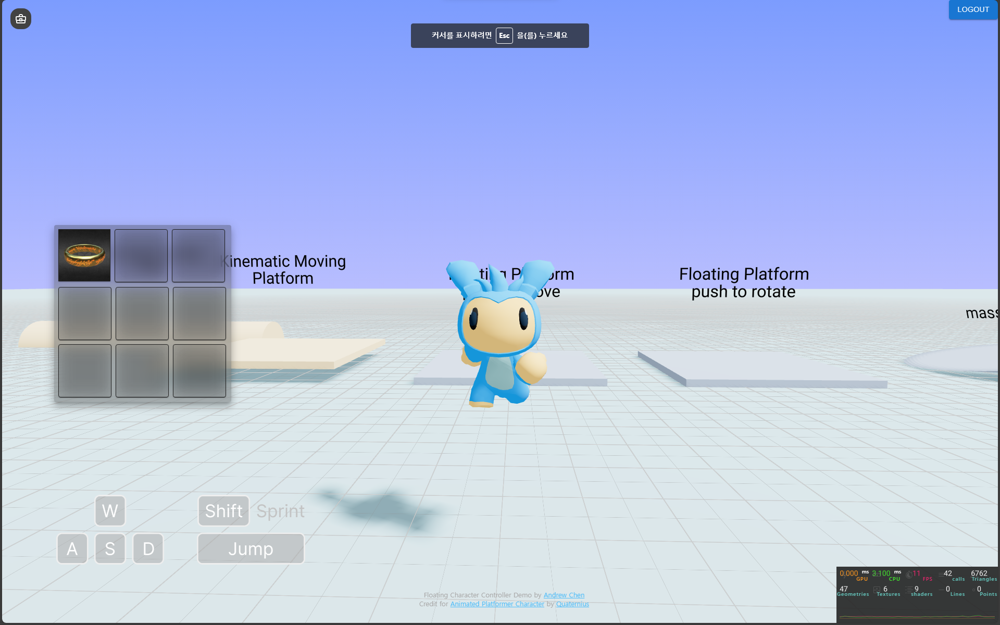
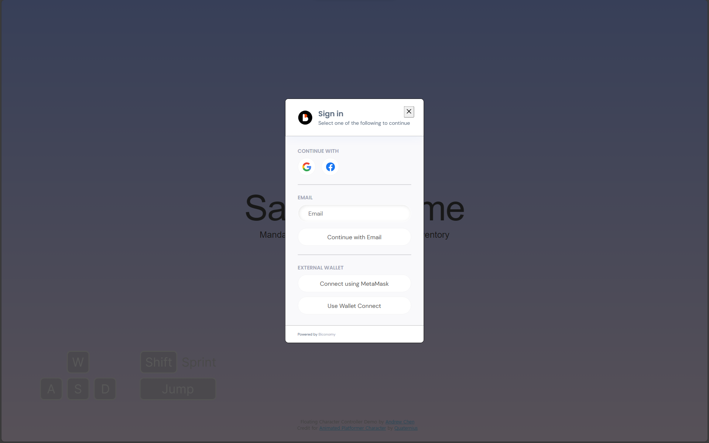

# Sample-Game [[Mandala](https://github.com/EthconKorea2023/mandala)]

This is the sample game applied "[Mandala](https://github.com/EthconKorea2023/mandala)" inventory system.

## ⚠️Before the Play

> You have to create Mock Character in [Mandala](https://nextjs-chunghosuk.vercel.app/) Dashboard!

## ▶️ How to Play

1. Click the Login button on the screen.
2. Wait for a seconds, You can see the Socical Login Dialog by Biconomy.
3. Login with any method what you want
4. Just Wait (Maximum 50s)
5. Play the GAME!

## Featrues

Simple web based character controller build on [react-three-fiber](https://github.com/pmndrs/react-three-fiber) and [react-three-rapier](https://github.com/pmndrs/react-three-rapier). It provides a playground demo where you can experience the following features:

1. Seamless movement over small obstacles
2. Enhanced control with floating force incorporating spring and damping forces
3. Rigidbody character functionality for interaction with the game environment
4. Customizable ground friction for tailored control
5. Realistic simulation with applied mass on supporting surfaces
6. Smooth integration with moving and rotating platforms
7. Inventory which is integrating Mandala Inventory system can share your item between totally different game that integrate the Mandala system.
8. No-boundary to access web3 gaming. Just Login with Google, facebook or any your email!

## License

This project is licensed under the [MIT License](https://opensource.org/licenses/MIT).
